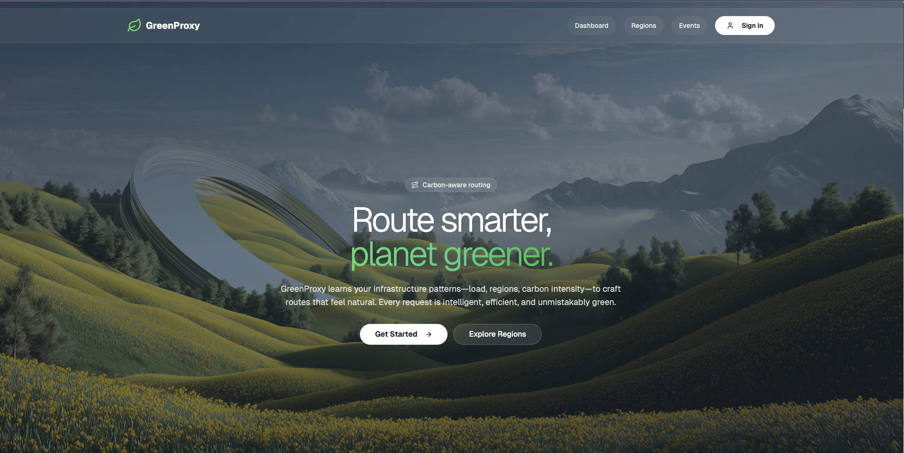
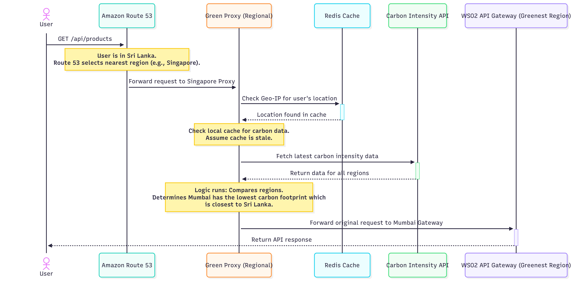

# Green Proxy - A Carbon-Aware API Proxy



Green-Router is an intelligent, lightweight API proxy designed to reduce the carbon footprint of digital services. Built with the cloud-native programming language Ballerina, this service dynamically routes incoming traffic to the cloud region with the lowest real-time carbon intensity, making your applications greener without sacrificing performance.

## The Problem: The Carbon Footprint of the Cloud

Every API request we serve consumes electricity in a data center. While the cloud is efficient, the energy powering these data centers often comes from a mix of renewable and fossil fuel sources. This energy mix changes constantly based on weather (windy or sunny) and grid demand.

A service running in Virginia might be powered by a high-carbon grid in the morning but a cleaner one at night. Meanwhile, a server in Ireland might be running on clean wind power. By being "carbon-aware," we can actively choose to run our workloads where the energy is greenest at any given moment.

## How It Minimizes Carbon Emissions

This project implements a strategy known as "carbon-aware load shifting." Instead of routing traffic based only on technical factors like latency, we add a new, intelligent to the routing mechanism called real-time carbon intensity.

The Green-Router proxy sits in front of your main application and acts as a smart entry point. Its core logic is simple but powerful:

- **1. Identify the User's Location** It determines the user's geographic location to understand the initial network path.
- **2. Fetch Real-time Grid Data** It calls an external Carbon Intensity API to get the current carbon emissions (gCO₂/kWh) for the power grids in each of your available AWS regions.
- **3. Make the Greenest Choice** It compares the carbon intensity of all regions and identifies which one is currently running on the cleanest energy.
- **4. Route the Request** It forwards the user's request to the application backend in that eco-friendly region.

## Architecture

The system is designed as a highly available, scalable, multi-region architecture on AWS.


- **1. Global DNS (Amazon Route 53)** A single global endpoint (api.wso2.com) uses latency-based routing to direct the user to the nearest AWS region for the best performance.
- **2. Regional Green Proxy (Ballerina on ECS)** In each region, our custom proxy runs on a scalable AWS Elastic Container Service. It receives the traffic from Route 53.
- **3. WSO2 API Gatewaye** The proxy forwards the request to the main WSO2 API Gateway, which handles core concerns like authentication, security, and rate-limiting.
- **4. Backend Service** The final application that processes the request.

## Request Flow

This is how api request handled by the Green Proxy



## Proxy Core Logic

The proxy's internal logic is designed for high performance by using a multi-level caching strategy.


## Quick Start

### Prerequisites

- [Ballerina](https://ballerina.io/) 2201.12.7 or later
- [Docker](https://www.docker.com/) and Docker Compose
- [Node.js](https://nodejs.org/) 18+ (for frontend)

### 1. Start Infrastructure Services

```bash
# Start Redis cache
docker-compose up -d
```

### 2. Start Carbon Emission API

```bash
cd sample_carbon_emission_api
npm install
npm start
# API available at http://localhost:3000
```

### 3. Start Green Proxy Service

```bash
cd green-proxy
bal run
# Service available at http://localhost:8080
```

### 4. Start Regional Services

```bash
cd eu_central_1_service
bal run
# Service available at http://localhost:3004
```

### 5. Start Frontend Dashboard

```bash
cd frontend
npm install
npm run dev
# Dashboard available at http://localhost:4001
```

## Frontend Dashboard

The React-based dashboard provides:

### **Dashboard**

- Real-time system status monitoring
- Current routing information
- Available regions overview
- Cache performance metrics

### **Region Explorer**

- IP address lookup tool
- All available regions display
- Carbon intensity comparison
- Country-to-region mapping

### **Cache Manager**

- Redis connection status
- Cache statistics and management
- Performance insights

### **Analytics**

- Carbon intensity trends
- Request distribution by region
- Environmental impact metrics

## 🔧 Configuration

### Green Proxy Configuration (`green-proxy/Config.toml`)

```toml
[green_proxy.services]
carbon_api_key="your-carbon-api-key"

[green_proxy.cache]
redisHost="localhost"
redisPort=6379
redisPassword=""
```

### Frontend Configuration (`frontend/.env`)

```env
VITE_API_BASE_URL=http://localhost:8080
VITE_REFRESH_INTERVAL=30000
```

## 🛠️ Project Structure

```
Ballerina-Project/
├── frontend/                  # React Dashboard
│   ├── src/
│   │   ├── components/       # UI Components
│   │   ├── pages/           # Page Components
│   │   └── services/        # API Services
│   └── package.json
├── green-proxy/              # Main Proxy Service
│   ├── modules/
│   │   ├── cache/           # Redis Caching
│   │   ├── services/        # Business Logic
│   │   ├── types/           # Type Definitions
│   │   └── utils/           # Utilities
│   └── main.bal
├── eu_central_1_service/     # Regional Service Example
├── sample_carbon_emission_api/ # Carbon Data API
└── docker-compose.yml        # Infrastructure
```
